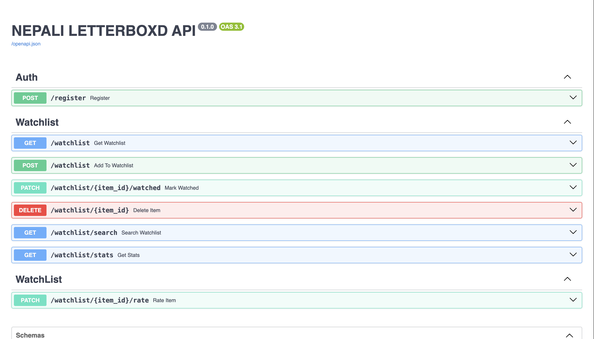

# NEPALI LETTERBOXD API made with FASTAPI
A personal movie & series watchlist API built with FastAPI

This project was fully thought and planned out by me as it also related with an issue i face day to day.This API can fix my as well as others problems.
here are some features that i incorporated onto this project:
1. API key auth per user
2. Track movies & series separately
3. Rate and review after watching
4. Personal stats
5. Search by title
6. Rate limiting to prevent abuse
7. Activity logging in background

i'll be soon trying to connect this to a basic frontend to make it fully usable for me.
